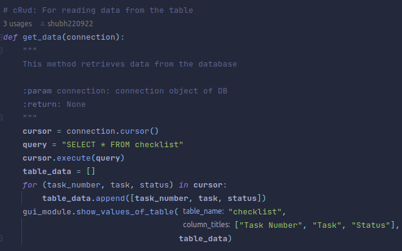
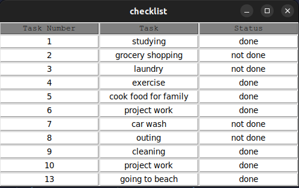
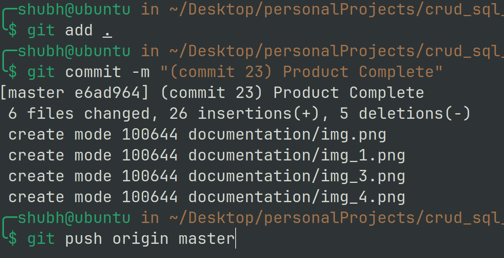
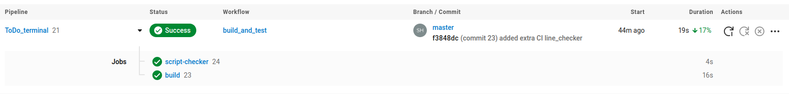
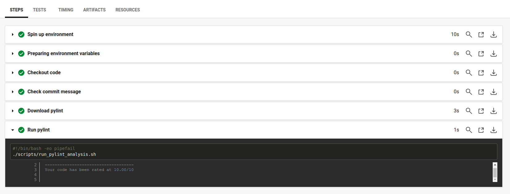

# Terminal ToDo App

### What is the project about?

This project is a simple checklist app written in python. Following is the structure of the project:

1. Database: mysql
2. GUI component: tkinter
3. Dependency management: poetry
4. CI/CD: circleCI

### Overview of the project:

1. Main logic of the code is to implement simple crud operations in the database. The following is the method to retrieve data from the database:
   

    This returns output in the following manner:
   

2. CICD checks have been set up for the following:

   1. Checking whether all the python files conform to the rules specified through pylint.
   2. Check whether commit message follows the pattern ``^\(commit\s+[0-9]+\)\s+.*$``
   3. Checking whether all the python files are less than or equal to 120 lines.
   4. Checking whether all shell files are less than 25 lines. \
    The config for all of this is in the ``.circleci/config.yml``

### Images depicting the build triggers in circleci after a push has been made to the repository:

### Triggers pipeline action in circleci dashboard:

